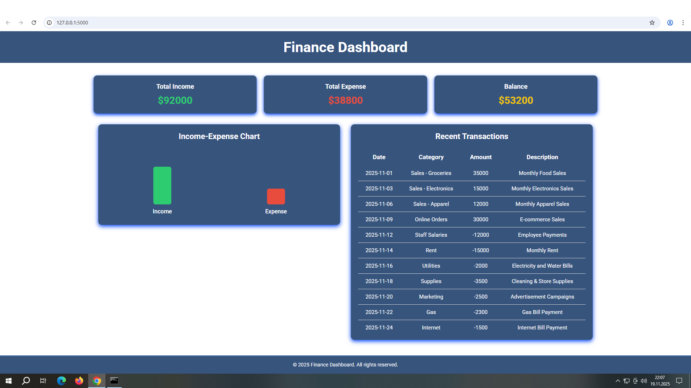

# Finance Dashboard

This Finance Dashboard project displays the real-time income and expense data of any corporate business. Regardless of the industry or profession, users can easily input any type of financial data they need.
The system processes and presents accurate financial information through a combination of jQuery on the frontend and backend operations, reflecting real values. The main dashboard shows income, expenses, and balance, all updated instantly.
In the “Recent Transactions” section, any type of data entered is immediately reflected in the income–expense bars, and the resulting financial outcome is displayed in the Total Income, Total Expense, and Balance sections.

  

## HOME PAGE

The first image that appears on the page that opens is the income and expense and balance data of a large food market.

  
